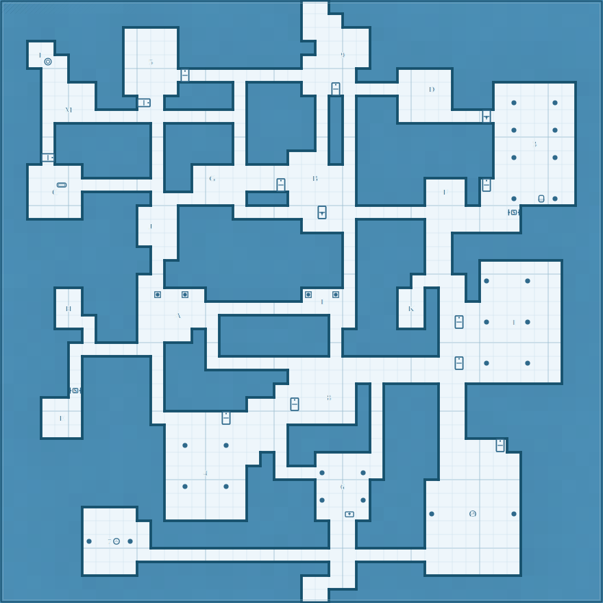

# Dwarven halls beneath the gatehouse

| Field           | Value           |
| --------------- | --------------- |
| Section ID      | dwarven-complex |
| Level           | 2               |
| Chapter         | Act II          |
| Pressure        | faction         |
| Session Load    | heavy           |
| Layout Strategy | constructed     |

**Promise:** Players explore the ancient dwarven halls, confronting the darkness the goblins feared.

## Tactical Footprint

| Field      | Value                      |
| ---------- | -------------------------- |
| Dimensions | 44 x 44                    |
| Density    | 38% floor coverage (dense) |
| Rooms      | 22                         |
| Corridors  | 27                         |

## Topology

### Node Inventory

| Node | Type         | Name               | Occupants         | Size   |
| ---- | ------------ | ------------------ | ----------------- | ------ |
| E1   | entry        | Stairs Up          | -                 | small  |
| R01  | guard        | Landing            | 2 skeletons       | medium |
| R02  | hub          | Great Hall         | -                 | large  |
| R03  | standard     | Barracks           | 4 goblins         | medium |
| R04  | standard     | Officers' Quarters | -                 | small  |
| R05  | resource     | Armoury            | -                 | small  |
| R06  | standard     | Mess Hall          | -                 | medium |
| R07  | standard     | Pantry             | -                 | small  |
| R08  | hub          | Gallery            | -                 | large  |
| R09  | standard     | Chapel             | -                 | medium |
| R10  | standard     | Vestry             | -                 | small  |
| R11  | standard     | Library            | -                 | medium |
| R12  | standard     | Scriptorium        | -                 | small  |
| R13  | hub          | Crossroads         | -                 | medium |
| R14  | standard     | Well Room          | -                 | small  |
| R15  | standard     | Store Room         | -                 | small  |
| R16  | standard     | Forge              | 2 fire elementals | large  |
| R17  | standard     | Smelting Room      | -                 | medium |
| R18  | faction-core | Throne Room        | Wraith lord       | large  |
| R19  | secret       | Treasury           | -                 | small  |
| R20  | standard     | Crypt              | 3 wights          | medium |
| X1   | exit         | Chasm Bridge       | -                 | small  |

### Connections

| From | To  | Type   | Bidir | Width    |
| ---- | --- | ------ | ----- | -------- |
| E1   | R01 | open   | Y     | standard |
| R01  | R02 | door   | Y     | wide     |
| R02  | R03 | open   | Y     | standard |
| R03  | R04 | door   | Y     | standard |
| R03  | R05 | door   | Y     | standard |
| R02  | R06 | open   | Y     | standard |
| R06  | R07 | open   | Y     | standard |
| R02  | R08 | open   | Y     | wide     |
| R08  | R09 | door   | Y     | standard |
| R09  | R10 | open   | Y     | standard |
| R08  | R11 | door   | Y     | standard |
| R11  | R12 | open   | Y     | standard |
| R02  | R13 | door   | Y     | standard |
| R08  | R13 | open   | Y     | standard |
| R13  | R14 | open   | Y     | standard |
| R13  | R15 | door   | Y     | standard |
| R13  | R16 | locked | Y     | standard |
| R16  | R17 | open   | Y     | standard |
| R16  | R18 | door   | Y     | wide     |
| R18  | R19 | secret | Y     | standard |
| R18  | R20 | door   | Y     | standard |
| R18  | X1  | locked | Y     | standard |
| R06  | R13 | door   | Y     | standard |
| R05  | R06 | secret | Y     | standard |
| R20  | R14 | door   | Y     | standard |

## Section Map



```text
######################..####################
######################...###################
#########....#########.....#################
##..#####....##########....#################
##.L.####..5.#########...9.#################
###..####....+............###....###########
###....##....####.####..+......D.###......##
###....###+.#####.#####.#.###....###.c..c.##
###..M............#####.#.###......L......##
###.#######.#####.#####.#.##########.c..c.##
###.#######.#####.#####.#.##########...3..##
###+#######.#####.###...#.##########.c..c.##
##....#####.##............##########......##
##..=.......##.G....+..B..#####...#+......##
##..C.#####.......###.....#####.F.#..c.tc.##
##....####...####......L.............S######
##########.J.#########....#####.......######
##########...############.#####..###########
###########..############.#####..###########
###########.#############.#####..##......###
##########..#############.####....#c..c..###
####..####.s.s.#######s.s.###..#..#......###
####.H####.............I..###.K#.........###
####...###...A..########..###..#.+.c.1c..###
######.###....#.########.#######.........###
#####.......###.########.#######.........###
#####.#####.###..................+.c..c..###
#####.#####.#########....................###
#####S#####.########......#.####..##########
###...#####.######...+..8.#.####..##########
###.E.#####.....+.........#.####..##########
###...######.........######.####..##########
############.c..c....######.####....+#######
############.......#.##.....####......######
############...4..##...c..c.####......######
############.c..c.#####..6.####.......######
############......#####c..c####.......######
######....##......#####..a.####c..2..c######
######.....#############..#####.......######
######c.7c.#############..#####.......######
######................................######
######....##############..#####.......######
######################....##################
######################..####################
```

## Room Key

**1. Gallery** (7x9, large)

- Type: hub
- Sightline: open

**2. Forge** (7x9, large)

- Occupants: 2 fire elementals
- Type: standard
- Sightline: open

**3. Throne Room** (6x9, large)

- Occupants: Wraith lord
- Type: faction-core
- Sightline: open

**4. Great Hall** (6x7, large)

- Type: hub
- Sightline: open

**5. Barracks** (4x5, medium)

- Occupants: 4 goblins
- Type: standard
- Sightline: open

**6. Chapel** (4x5, medium)

- Type: standard
- Sightline: open

**7. Smelting Room** (4x5, medium)

- Type: standard
- Sightline: open

**8. Landing** (4x4, medium)

- Occupants: 2 skeletons
- Type: guard
- Sightline: open

**9. Mess Hall** (4x4, medium)

- Type: standard
- Sightline: open

**A. Library** (4x4, medium)

- Type: standard
- Sightline: open

**B. Crossroads** (4x4, medium)

- Type: hub
- Sightline: open

**C. Crypt** (4x4, medium)

- Occupants: 3 wights
- Type: standard
- Sightline: open

**D. Officers' Quarters** (3x3, small)

- Type: standard
- Sightline: open

**E. Armoury** (3x3, small)

- Type: resource
- Sightline: open

**F. Stairs Up** (3x2, small)

- Type: entry
- Sightline: open

**G. Pantry** (3x2, small)

- Type: standard
- Sightline: open

**H. Vestry** (2x3, small)

- Type: standard
- Sightline: open

**I. Scriptorium** (3x2, small)

- Type: standard
- Sightline: open

**J. Store Room** (2x3, small)

- Type: standard
- Sightline: open

**K. Treasury** (2x3, small)

- Type: secret
- Sightline: open

**L. Well Room** (2x2, small)

- Type: standard
- Sightline: open

**M. Chasm Bridge** (2x2, small)

- Type: exit
- Sightline: open

## Transition Connectors

| Connector | Side   | Offset | Width | Type     | Destination |
| --------- | ------ | ------ | ----- | -------- | ----------- |
| C1        | top    | 22     | 2     | vertical | Gatehouse   |
| C2        | bottom | 22     | 2     | vertical | Deep Caves  |

## Encounter Ecology

Territory and patrol model derived from topology depth, room role, and section pressure.

### Territory Zones

| Zone      | Rooms                                                                                                                                                                                        | Description                                           | Control                  | Response                             |
| --------- | -------------------------------------------------------------------------------------------------------------------------------------------------------------------------------------------- | ----------------------------------------------------- | ------------------------ | ------------------------------------ |
| Perimeter | F (Stairs Up); 8 (Landing)                                                                                                                                                                   | First-contact ring. Delay intruders and raise alarms. | Sentry-controlled        | Delay and signal.                    |
| Transit   | 4 (Great Hall); 5 (Barracks); D (Officers' Quarters); E (Armoury); 9 (Mess Hall); G (Pantry); 1 (Gallery); 6 (Chapel); A (Library); B (Crossroads); L (Well Room); J (Store Room); 2 (Forge) | Circulation band linking wings and support rooms.     | Occupied service spaces  | Screen and fall back to chokepoints. |
| Core      | H (Vestry); I (Scriptorium); 7 (Smelting Room); 3 (Throne Room); C (Crypt); M (Chasm Bridge)                                                                                                 | Command/treasure depth where defenders concentrate.   | Primary faction hold     | Hold position and counterattack.     |
| Hidden    | K (Treasury)                                                                                                                                                                                 | Irregular spaces outside routine movement.            | Low traffic / hidden use | Ambush or opportunistic withdrawal.  |

### Patrols

| Patrol | Owner          | Route                 | Interval | Triggers                                     | Fallback |
| ------ | -------------- | --------------------- | -------- | -------------------------------------------- | -------- |
| P1     | 8 (Landing)    | 8 -> 4 -> 1 -> 6 -> H | 10 min   | Missing sentry, alarm gong, or blocked route | H        |
| P2     | 4 (Great Hall) | 4 -> 1 -> 6 -> H      | 10 min   | Missing sentry, alarm gong, or blocked route | H        |
| P3     | 1 (Gallery)    | 1 -> 6 -> H           | 10 min   | Missing sentry, alarm gong, or blocked route | H        |

## Dynamic Behaviour

Escalation clocks and reactive movement generated from section pressure and patrol ownership.

| Clock     | Trigger                                                                                                                                                                                                      | Effect                                                                          | Reset                                  |
| --------- | ------------------------------------------------------------------------------------------------------------------------------------------------------------------------------------------------------------ | ------------------------------------------------------------------------------- | -------------------------------------- |
| Suspicion | Disturbance in F (Stairs Up); 8 (Landing)                                                                                                                                                                    | Patrol P1 re-runs route (8 -> 4 -> 1 -> 6 -> H) with no detours.                | 20 minutes with no new signs           |
| Alerted   | Combat/noise in 4 (Great Hall); 5 (Barracks); D (Officers' Quarters); E (Armoury); 9 (Mess Hall); G (Pantry); 1 (Gallery); 6 (Chapel); A (Library); B (Crossroads); L (Well Room); J (Store Room); 2 (Forge) | Reinforcements move to nearest chokepoint and lock contested doors.             | 45 minutes with no contact             |
| Committed | Core threatened (H (Vestry); I (Scriptorium); 7 (Smelting Room); 3 (Throne Room); C (Crypt); M (Chasm Bridge))                                                                                               | Defenders abandon perimeter and concentrate on core defence or evacuation path. | End of scene / regroup outside section |

### Escalation Sequence

1. Initial contact pressure follows **faction** cues and starts at perimeter routes.
2. Patrol cadence is **10 min**; skipped check-ins immediately escalate one clock step.
3. Once committed, defenders preserve one fallback route and deny all secondary routes until reset.

## Validation Checklist

- [x] Grid size: 44x44 within 60x60 limit
- [x] Entry and exit exist: 1 entry, 1 exit
- [x] Guard placement: All 1 guards within 2 edges of entry
- [x] Boss/treasure depth: All high-value nodes at depth >= 2 from entry
- [x] Loop count: 4 loops (need >= 4 for 22 nodes)
- [ ] Two independent routes: Only 1 route from E1 to X1 (need >= 2)
- [ ] Dead end justification: Node R04 (standard) is a dead end without justification (type should be secret, hazard, or set-piece)
- [x] One-way safety: No one-way edges
- [x] Rooms within bounds: All rooms within grid bounds
- [x] No room overlaps: No room overlaps
- [x] All nodes placed: All 22 nodes have placed rooms
- [x] Large room exists: At least one large room present
- [x] Connectors connected: All 2 connectors connect to playable space

## DM Quick-Run Notes

**Theme:** Dwarven halls beneath the gatehouse
**Promise:** Players explore the ancient dwarven halls, confronting the darkness the goblins feared.

**Entry points:** E1 (Stairs Up)
**Exit points:** X1 (Chasm Bridge)
**Hub rooms:** R02 (Great Hall), R08 (Gallery), R13 (Crossroads)

### Key Decision Points

- **Great Hall:** connects to R01 (door), R03 (open), R06 (open), R08 (open), R13 (door)
- **Gallery:** connects to R02 (open), R09 (door), R11 (door), R13 (open)
- **Crossroads:** connects to R02 (door), R08 (open), R14 (open), R15 (door), R16 (locked), R06 (door)
