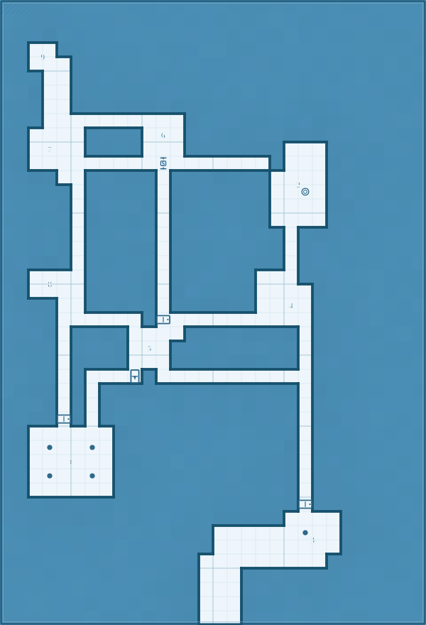

# Goblin-occupied dwarven gatehouse

| Field           | Value          |
| --------------- | -------------- |
| Section ID      | gatehouse-ruin |
| Level           | 1              |
| Chapter         | Act I          |
| Pressure        | faction        |
| Session Load    | standard       |
| Layout Strategy | constructed    |

**Promise:** Players breach the outer defences and discover the goblins are fortifying against something deeper.

## Tactical Footprint

| Field      | Value                         |
| ---------- | ----------------------------- |
| Dimensions | 30 x 44                       |
| Density    | 19% floor coverage (standard) |
| Rooms      | 9                             |
| Corridors  | 12                            |

## Topology

### Node Inventory

| Node | Type         | Name           | Occupants                    | Size   |
| ---- | ------------ | -------------- | ---------------------------- | ------ |
| E1   | entry        | Collapsed Gate | -                            | medium |
| G1   | guard        | Guard Post     | 2 goblin sentries            | medium |
| H1   | hub          | Gatehouse Hall | -                            | medium |
| R1   | standard     | Barracks       | 4 goblins                    | small  |
| R2   | resource     | Armoury        | -                            | small  |
| R3   | resource     | Kitchen/Well   | 1 noncombatant cook          | medium |
| F1   | faction-core | Boss Room      | Hobgoblin boss + 1 bodyguard | large  |
| S1   | secret       | Old Vault      | -                            | small  |
| X1   | exit         | Stairs Down    | -                            | small  |

### Connections

| From | To  | Type   | Bidir | Width    |
| ---- | --- | ------ | ----- | -------- |
| E1   | G1  | door   | Y     | standard |
| G1   | H1  | open   | Y     | standard |
| H1   | R1  | open   | Y     | standard |
| H1   | R3  | door   | Y     | standard |
| H1   | F1  | locked | Y     | standard |
| R1   | R2  | open   | Y     | standard |
| R3   | X1  | open   | Y     | standard |
| F1   | S1  | secret | Y     | standard |
| F1   | X1  | door   | Y     | standard |
| R2   | H1  | secret | Y     | standard |
| E1   | H1  | open   | Y     | standard |

## Section Map



```text
##############################
##############################
##############################
##..##########################
##.9.#########################
###..#########################
###..#########################
###..#########################
###..........#################
##....####.6.#################
##.7..####...#######...#######
##.........S.......#...#######
####..#####.#######....#######
#####.#####.#######..2.#######
#####.#####.#######....#######
#####.#####.#######....#######
#####.#####.########.#########
#####.#####.########.#########
#####.#####.########.#########
##....#####.######...#########
##.8..#####.######....########
####..#####.######..4.########
####......#+..........########
####.####....########.########
####.####.5.#########.########
####.####...#########.########
####.#...L#...........########
####.#.##############.########
####.#.##############.########
####+#.##############.########
##......#############.########
##.c..c.#############.########
##...1..#############.########
##.c..c.#############.########
##......#############.########
#####################+########
####################....######
###############......c..######
###############.......3.######
##############.........#######
##############...#############
##############...#############
##############...#############
##############...#############
```

## Room Key

**1. Boss Room** (6x5, large)

- Occupants: Hobgoblin boss + 1 bodyguard
- Type: faction-core
- Sightline: open
- Retreat: X1

**2. Kitchen/Well** (4x6, medium)

- Occupants: 1 noncombatant cook
- Type: resource
- Sightline: open
- Retreat: X1

**3. Collapsed Gate** (4x4, medium)

- Type: entry
- Sightline: open
- Retreat: G1

**4. Guard Post** (3x3, medium)

- Occupants: 2 goblin sentries
- Type: guard
- Sightline: partial
- Retreat: H1

**5. Gatehouse Hall** (3x3, medium)

- Type: hub
- Sightline: open
- Retreat: R1, R3, F1

**6. Armoury** (3x3, small)

- Type: resource
- Sightline: blocked
- Retreat: R1

**7. Stairs Down** (3x3, small)

- Type: exit
- Sightline: partial
- Retreat: R3, F1

**8. Old Vault** (3x2, small)

- Type: secret
- Sightline: blocked

**9. Barracks** (2x2, small)

- Occupants: 4 goblins
- Type: standard
- Sightline: blocked
- Retreat: H1

## Transition Connectors

| Connector | Side   | Offset | Width | Type     | Destination |
| --------- | ------ | ------ | ----- | -------- | ----------- |
| C1        | bottom | 15     | 3     | vertical | Deep Caves  |

## Encounter Ecology

Territory and patrol model derived from topology depth, room role, and section pressure.

### Territory Zones

| Zone      | Rooms                                                                       | Description                                           | Control                  | Response                             |
| --------- | --------------------------------------------------------------------------- | ----------------------------------------------------- | ------------------------ | ------------------------------------ |
| Perimeter | 3 (Collapsed Gate); 4 (Guard Post); 5 (Gatehouse Hall)                      | First-contact ring. Delay intruders and raise alarms. | Sentry-controlled        | Delay and signal.                    |
| Transit   | -                                                                           | Circulation band linking wings and support rooms.     | Lightly held             | Screen and fall back to chokepoints. |
| Core      | 9 (Barracks); 6 (Armoury); 2 (Kitchen/Well); 1 (Boss Room); 7 (Stairs Down) | Command/treasure depth where defenders concentrate.   | Primary faction hold     | Hold position and counterattack.     |
| Hidden    | 8 (Old Vault)                                                               | Irregular spaces outside routine movement.            | Low traffic / hidden use | Ambush or opportunistic withdrawal.  |

### Patrols

| Patrol | Owner              | Route       | Interval | Triggers                                     | Fallback |
| ------ | ------------------ | ----------- | -------- | -------------------------------------------- | -------- |
| P1     | 4 (Guard Post)     | 4 -> 5 -> 9 | 15 min   | Missing sentry, alarm gong, or blocked route | 9        |
| P2     | 5 (Gatehouse Hall) | 5 -> 9      | 15 min   | Missing sentry, alarm gong, or blocked route | 9        |
| P3     | 1 (Boss Room)      | 1 -> 7      | 15 min   | Missing sentry, alarm gong, or blocked route | 9        |

## Dynamic Behaviour

Escalation clocks and reactive movement generated from section pressure and patrol ownership.

| Clock     | Trigger                                                                                       | Effect                                                                          | Reset                                  |
| --------- | --------------------------------------------------------------------------------------------- | ------------------------------------------------------------------------------- | -------------------------------------- |
| Suspicion | Disturbance in 3 (Collapsed Gate); 4 (Guard Post); 5 (Gatehouse Hall)                         | Patrol P1 re-runs route (4 -> 5 -> 9) with no detours.                          | 20 minutes with no new signs           |
| Alerted   | Combat/noise in -                                                                             | Reinforcements move to nearest chokepoint and lock contested doors.             | 45 minutes with no contact             |
| Committed | Core threatened (9 (Barracks); 6 (Armoury); 2 (Kitchen/Well); 1 (Boss Room); 7 (Stairs Down)) | Defenders abandon perimeter and concentrate on core defence or evacuation path. | End of scene / regroup outside section |

### Escalation Sequence

1. Initial contact pressure follows **faction** cues and starts at perimeter routes.
2. Patrol cadence is **15 min**; skipped check-ins immediately escalate one clock step.
3. Once committed, defenders preserve one fallback route and deny all secondary routes until reset.

## Validation Checklist

- [x] Grid size: 30x44 within 60x60 limit
- [x] Entry and exit exist: 1 entry, 1 exit
- [x] Guard placement: All 1 guards within 2 edges of entry
- [x] Boss/treasure depth: All high-value nodes at depth >= 2 from entry
- [x] Loop count: 3 loops (need >= 2 for 9 nodes)
- [x] Two independent routes: 2 independent routes from E1 to X1
- [x] Dead end justification: All dead ends justified
- [x] One-way safety: No one-way edges
- [x] Rooms within bounds: All rooms within grid bounds
- [x] No room overlaps: No room overlaps
- [x] All nodes placed: All 9 nodes have placed rooms
- [x] Large room exists: At least one large room present
- [x] Connectors connected: All 1 connectors connect to playable space

## DM Quick-Run Notes

**Theme:** Goblin-occupied dwarven gatehouse
**Promise:** Players breach the outer defences and discover the goblins are fortifying against something deeper.

**Entry points:** E1 (Collapsed Gate)
**Exit points:** X1 (Stairs Down)
**Hub rooms:** H1 (Gatehouse Hall)

### Key Decision Points

- **Gatehouse Hall:** connects to G1 (open), R1 (open), R3 (door), F1 (locked), R2 (secret), E1 (open)
