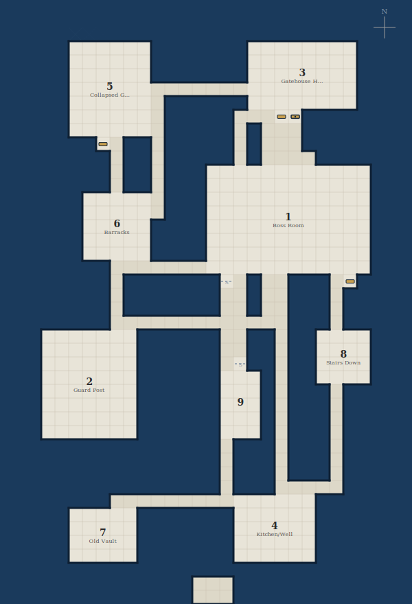

# Goblin-occupied dwarven gatehouse

| Field           | Value          |
| --------------- | -------------- |
| Section ID      | gatehouse-ruin |
| Level           | 1              |
| Chapter         | Act I          |
| Pressure        | faction        |
| Session Load    | standard       |
| Layout Strategy | constructed    |

**Promise:** Players breach the outer defences and discover the goblins are fortifying against something deeper.

## Tactical Footprint

| Field      | Value                         |
| ---------- | ----------------------------- |
| Dimensions | 30 x 44                       |
| Density    | 35% floor coverage (standard) |
| Rooms      | 9                             |
| Corridors  | 11                            |

## Topology

### Node Inventory

| Node | Type         | Name           | Occupants                    | Size   |
| ---- | ------------ | -------------- | ---------------------------- | ------ |
| E1   | entry        | Collapsed Gate | -                            | medium |
| G1   | guard        | Guard Post     | 2 goblin sentries            | medium |
| H1   | hub          | Gatehouse Hall | -                            | medium |
| R1   | standard     | Barracks       | 4 goblins                    | small  |
| R2   | resource     | Armoury        | -                            | small  |
| R3   | resource     | Kitchen/Well   | 1 noncombatant cook          | medium |
| F1   | faction-core | Boss Room      | Hobgoblin boss + 1 bodyguard | large  |
| S1   | secret       | Old Vault      | -                            | small  |
| X1   | exit         | Stairs Down    | -                            | small  |

### Connections

| From | To  | Type   | Bidir | Width    |
| ---- | --- | ------ | ----- | -------- |
| E1   | G1  | door   | Y     | standard |
| G1   | H1  | open   | Y     | standard |
| H1   | R1  | open   | Y     | standard |
| H1   | R3  | door   | Y     | standard |
| H1   | F1  | locked | Y     | standard |
| R1   | R2  | open   | Y     | standard |
| R3   | X1  | open   | Y     | standard |
| F1   | S1  | secret | Y     | standard |
| F1   | X1  | door   | Y     | standard |
| R2   | H1  | secret | Y     | standard |
| E1   | H1  | open   | Y     | standard |

## Section Map



```text
##############################
##############################
##############################
#####......#######........####
#####......#######........####
#####......#######....3...####
#####...5.................####
#####.......######........####
#####.......#####...+L########
#####.......#####.#...########
#######+.##.#####.#...########
########.##.#####.#....#######
########.##.###............###
########.##.###............###
######......###............###
######......###............###
######..6..####......1.....###
######.....####............###
######.....####............###
########...................###
########.#######S.#..###.+####
########.#######..#..###.#####
########.#######..#..###.#####
########.............###.#####
###.......######..##.##....###
###.......######..##.##....###
###.......######.S##.##..8.###
###.......######...#.##....###
###...2...######...#.###.#####
###.......######.9.#.###.#####
###.......######...#.###.#####
###.......######...#.###.#####
################.###.###.#####
################.###.###.#####
################.###.###.#####
################.###.....#####
########...............#######
#####.....#######......#######
#####.....#######...4..#######
#####..7..#######......#######
#####.....#######......#######
##############################
##############...#############
##############...#############
```

## Room Key

**1. Boss Room** (12x8, large)

- Occupants: Hobgoblin boss + 1 bodyguard
- Type: faction-core
- Sightline: open
- Retreat: X1

**2. Guard Post** (7x8, medium)

- Occupants: 2 goblin sentries
- Type: guard
- Sightline: partial
- Retreat: H1

**3. Gatehouse Hall** (8x5, medium)

- Type: hub
- Sightline: open
- Retreat: R1, R3, F1

**4. Kitchen/Well** (6x5, medium)

- Occupants: 1 noncombatant cook
- Type: resource
- Sightline: open
- Retreat: X1

**5. Collapsed Gate** (6x7, medium)

- Type: entry
- Sightline: open
- Retreat: G1

**6. Barracks** (5x5, small)

- Occupants: 4 goblins
- Type: standard
- Sightline: blocked
- Retreat: H1

**7. Old Vault** (5x4, small)

- Type: secret
- Sightline: blocked

**8. Stairs Down** (4x4, small)

- Type: exit
- Sightline: partial
- Retreat: R3, F1

**9. Armoury** (3x5, small)

- Type: resource
- Sightline: blocked
- Retreat: R1

## Transition Connectors

| Connector | Side   | Offset | Width | Type     | Destination |
| --------- | ------ | ------ | ----- | -------- | ----------- |
| C1        | bottom | 15     | 3     | vertical | Deep Caves  |

## Encounter Ecology

Territory zones, patrol routes, and creature behaviour to be defined.

### Territory Zones

| Zone    | Rooms | Description |
| ------- | ----- | ----------- |
| Core    | -     | -           |
| Buffer  | -     | -           |
| Transit | -     | -           |

### Patrols

| Patrol | Owner | Route | Interval | Triggers | Fallback |
| ------ | ----- | ----- | -------- | -------- | -------- |
| -      | -     | -     | -        | -        | -        |

## Dynamic Behaviour

Timers, triggered events, and escalation sequences to be defined.

## Validation Checklist

- [x] Grid size: 30x44 within 30x44 limit
- [x] Entry and exit exist: 1 entry, 1 exit
- [x] Guard placement: All 1 guards within 2 edges of entry
- [x] Boss/treasure depth: All high-value nodes at depth >= 2 from entry
- [x] Loop count: 3 loops (need >= 2 for 9 nodes)
- [x] Two independent routes: 2 independent routes from E1 to X1
- [x] Dead end justification: All dead ends justified
- [x] One-way safety: No one-way edges
- [x] Rooms within bounds: All rooms within grid bounds
- [x] No room overlaps: No room overlaps
- [x] All nodes placed: All 9 nodes have placed rooms
- [x] Large room exists: At least one large room present

## DM Quick-Run Notes

**Theme:** Goblin-occupied dwarven gatehouse
**Promise:** Players breach the outer defences and discover the goblins are fortifying against something deeper.

**Entry points:** E1 (Collapsed Gate)
**Exit points:** X1 (Stairs Down)
**Hub rooms:** H1 (Gatehouse Hall)

### Key Decision Points

- **Gatehouse Hall:** connects to G1 (open), R1 (open), R3 (door), F1 (locked), R2 (secret), E1 (open)
